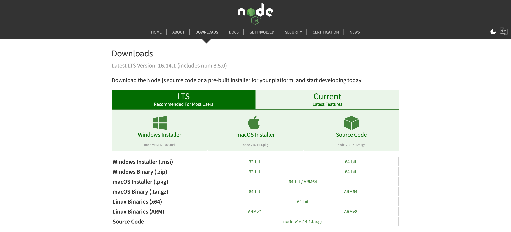

# Employee Tracker

## Table of Contents

* [Description](#description)
* [Visuals](#visuals)
* [Installation](#installation)
* [Technologies](#technologies)
* [Licenses](#licenses)
* [Support](#support)
* [Authors](#authors)
* [Contributions](#contributions)

## Description

Welcome to the Team Profile Generator, where you can create an reference sheet for need-to-know information about your teammates, all from a Command Line application! The generated webpage will have a clean and readable appearance, working links to emails and GitHub profiles, and will be responsive to all screen sizes. 

## Visuals

The following image is of the website where you will download Node JS, if necessary.

The last portion of the directory displayed here reflects what you should see in your command line before running "npm install".

This is the command to install your dependencies.

This is the command to initialize the function.

The following image is an example of the layout of a markdown file generated by this application.

[Click here for a video explaining installation and initalizing the application](https://www.awesomescreenshot.com/video/7947609?key=57d1bfd4a7bba8ca1ea09fc1aad51b9b)

## Installation

To enjoy this application, you will need to install Node JS on your local computer. [Click here for links to download Node JS.](https://nodejs.org/en/download/)

Then, clone this repository to your local computer, and open up the folder in your coding software (i.e. Visual Studio Code). Once open, open up your Terminal (on Mac OS) or GitBash (on Windows OS). You will have to direct yourself to the cloned repository, and then run this command in the terminal: "npm install". This will download the node modules Jest and Inquirer that this application needs to run on your local computer. 

After install, you will run the following in the terminal: "node index.js". This will trigger the Inquirer module to begin asking questions about your staff in the terminal. For each response, all you need to do is type out your response as you would like it to appear in the final webpage (correct capitalization/emails etc.). Once you enter the information for the manager of your organization, then you will be asked if you would like to add another staff member, or finish.

Once you finish entering staff information, the application will dynamically create an index.html file in the dist folder located in the repository. The HTML file will have generated cards for each staff member compiling their information, working links for engineer's GitHub profiles, and links that open your preferred email browser to send an email to the staff member. This page is screen-size responsive, so it will also work on mobile  devices.

[Click here for a video explaining installation and initalizing the application](https://www.awesomescreenshot.com/video/7947609?key=57d1bfd4a7bba8ca1ea09fc1aad51b9b)

## Technologies

* Node JS
* NPM
* Inquirer module
* Jest
* Bootstrap
* Font Awesome

## Licenses

This application uses the MIT Software License. [Click here to view full license.](LICENSE)

## Support

Contact us at devonfaria@gmail.com if you need assistance downloading or activating this repository. You can also find me on [GitHub.](https://github.com/devonfaria)

## Authors

Devon Faria

## Contributions

A huge thank you to my tutor, Evan Hardek, for walking me through Jest testing and some template literal methods I wasn't aware of. 